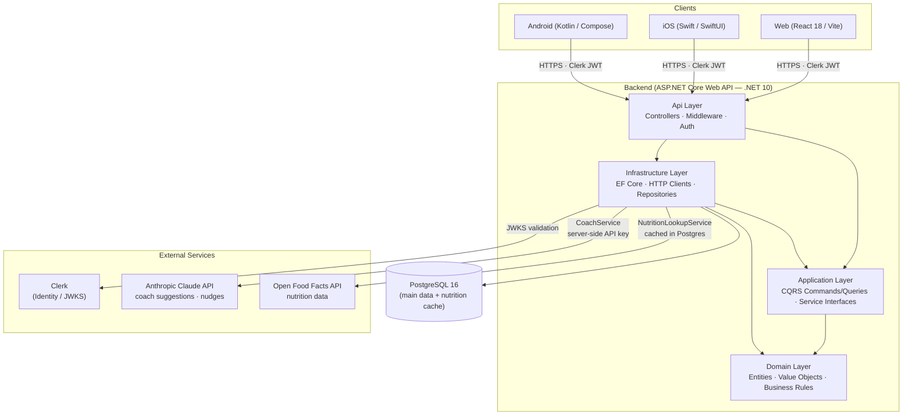

# MAI Health Coach

A MyFitnessPal-style health and wellness app — website and native mobile — for
logging daily food, water, and exercise. Includes barcode scanning to identify
packaged foods and a Claude-powered AI coach that delivers meal suggestions and
motivational nudges.

**Project board (GitHub Project #11):**
https://github.com/users/CJFuentes/projects/11

---

## Table of Contents

1. [Product Overview](#product-overview)
2. [Tech Stack](#tech-stack)
3. [Monorepo Layout](#monorepo-layout)
4. [Architecture](#architecture)
5. [Local Development — Quick Start](#local-development--quick-start)
   - [Backend (.NET)](#backend-net)
   - [Web (React + Vite)](#web-react--vite)
   - [iOS (Swift/SwiftUI)](#ios-swiftswiftui)
   - [Android (Kotlin/Compose)](#android-kotlincompose)
6. [Branch & PR Convention](#branch--pr-convention)
7. [Contributing](#contributing)
8. [License](#license)

---

## Product Overview

MAI Health Coach lets users:

- Log meals, water intake, and workouts daily
- Scan product barcodes to auto-populate nutrition data (powered by Open Food
  Facts, proxied through the backend — clients never call OFF directly)
- Receive AI-generated meal suggestions and motivational nudges via a
  Claude-powered coach endpoint

---

## Tech Stack

| Layer          | Technology                                        |
|----------------|---------------------------------------------------|
| Backend API    | ASP.NET Core Web API (.NET 10), layered architecture (Api / Application / Domain / Infrastructure) |
| Database       | PostgreSQL + Entity Framework Core                |
| Auth           | Clerk — backend validates Clerk JWTs against JWKS |
| AI Coach       | Anthropic Claude API (`claude-sonnet-4-6` default, `claude-opus-4-8` for escalated requests) |
| Food Data      | Open Food Facts — accessed only via backend `NutritionLookupService` with Postgres cache |
| Web Front-end  | React 18 + TypeScript, Vite                       |
| iOS            | Swift + SwiftUI (native)                          |
| Android        | Kotlin + Jetpack Compose (native)                 |
| Containers     | Podman — `Containerfile` + Compose for local dev; pods/systemd for production |
| CI             | GitHub Actions                                    |

---

## Monorepo Layout

```
maihealthcoach/
├── backend/        # ASP.NET Core Web API
├── web/            # React + TypeScript (Vite)
├── ios/            # Native iOS app (Swift/SwiftUI)
├── android/        # Native Android app (Kotlin/Compose)
├── deploy/         # Containerfiles, Compose, CI/CD config
├── docs/           # Architecture diagrams, ADRs, API docs
├── .github/        # GitHub Actions workflows, PR template
├── .editorconfig
├── .gitattributes
├── .gitignore
├── CONTRIBUTING.md
├── LICENSE
└── README.md
```

---

## Architecture

> The canonical source for this diagram is [`docs/architecture.md`](docs/architecture.md).
> Keep both files in sync when the architecture changes.



---

## Local Development — Quick Start

### Prerequisites

- [.NET 10 SDK](https://dotnet.microsoft.com/download)
- [Node.js 20+ & npm](https://nodejs.org/)
- [PostgreSQL 16](https://www.postgresql.org/) or Docker/Podman
- [Podman](https://podman.io/) (optional — for containerized local stack)
- [Xcode 16+](https://developer.apple.com/xcode/) (macOS only, for iOS)
- [Android Studio Hedgehog+](https://developer.android.com/studio) (for Android)

### Backend (.NET)

```bash
cd backend
cp appsettings.Development.json.example appsettings.Development.json
# Fill in: ConnectionStrings__Default, Clerk__Authority, Anthropic__ApiKey
dotnet restore
dotnet ef database update          # applies EF Core migrations
dotnet run --project src/Api
# API available at https://localhost:5001
```

### Web (React + Vite)

```bash
cd web
cp .env.example .env.local
# Fill in: VITE_API_BASE_URL, VITE_CLERK_PUBLISHABLE_KEY
npm install
npm run dev
# App available at http://localhost:5173
```

### iOS (Swift/SwiftUI)

```bash
cd ios
open MAIHealthCoach.xcworkspace   # or .xcodeproj if no workspace yet
# Select a simulator target and press Run (⌘R)
# Configure Config/Debug.xcconfig with CLERK_PUBLISHABLE_KEY and API_BASE_URL
```

### Android (Kotlin/Compose)

```bash
cd android
# Open the android/ folder in Android Studio
# Create local.properties with: sdk.dir=/path/to/android-sdk
# Run via Run > Run 'app' or ./gradlew installDebug
```

### Full Local Stack with Podman Compose

```bash
cd deploy
cp .env.example .env          # first time only — edit credentials if desired
podman compose up             # reads compose.yml automatically
# or: docker compose up
# API:    http://localhost:8080
# Health: http://localhost:8080/healthz
```

---

## Branch & PR Convention

See [CONTRIBUTING.md](CONTRIBUTING.md) for the full workflow. Summary:

| Type       | Branch pattern                  | Example                        |
|------------|---------------------------------|--------------------------------|
| Feature    | `feature/<issue#>-short-slug`   | `feature/1-repo-structure`     |
| Bug fix    | `fix/<issue#>-short-slug`       | `fix/42-barcode-crash`         |
| Chore      | `chore/<issue#>-short-slug`     | `chore/7-update-deps`          |
| Docs       | `docs/<issue#>-short-slug`      | `docs/3-adr-auth`              |
| Release    | `release/vX.Y.Z`                | `release/v1.0.0`               |
| Hotfix     | `hotfix/vX.Y.Z-short-slug`      | `hotfix/v1.0.1-login-timeout`  |

- All work happens on a branch; direct pushes to `main` are blocked.
- PR titles follow Conventional Commits: `feat(backend): add barcode endpoint (#12)`
- Every PR description must link to its issue with `Closes #N`.

---

## Contributing

Read [CONTRIBUTING.md](CONTRIBUTING.md) before opening a PR.

---

## License

MIT — see [LICENSE](LICENSE).
