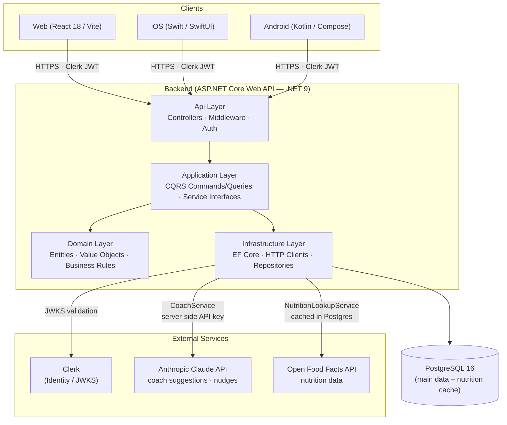

# MAI Health Coach — System Architecture

> This is the canonical diagram source. The root `README.md` mirrors this.
> Update here first when the architecture changes.

Last updated: 2026-06-21

## System Context Diagram

## Key Design Constraints

| Constraint | Rationale |
|---|---|
| Clients never call Open Food Facts directly | Rate limits, key management, and caching belong server-side |
| Claude API key is server-side only | Never exposed to clients; prevents key leakage |
| Clerk JWTs validated server-side via JWKS | Standard OAuth2/OIDC pattern; no custom auth code |
| Podman instead of Docker | OCI-compatible; rootless containers; no daemon |

## Layer Responsibilities

### Api Layer (`backend/src/Api/`)
HTTP entry point. Route definitions, controller actions, middleware pipeline
(authentication, error handling, logging), and dependency injection
registration.

### Application Layer (`backend/src/Application/`)
Orchestrates use cases. CQRS command and query handlers, DTOs, service
interfaces (implemented in Infrastructure). No database or HTTP client code.

### Domain Layer (`backend/src/Domain/`)
Pure business logic. Entities (`User`, `DailyLog`, `FoodEntry`,
`WaterEntry`, `ExerciseEntry`), value objects, domain events, and
invariant enforcement. No infrastructure dependencies.

### Infrastructure Layer (`backend/src/Infrastructure/`)
All I/O. EF Core `DbContext` and configurations, repository implementations,
`NutritionLookupService` (OFF HTTP client + Postgres cache),
`CoachService` (Anthropic SDK), Clerk JWKS HTTP client.
